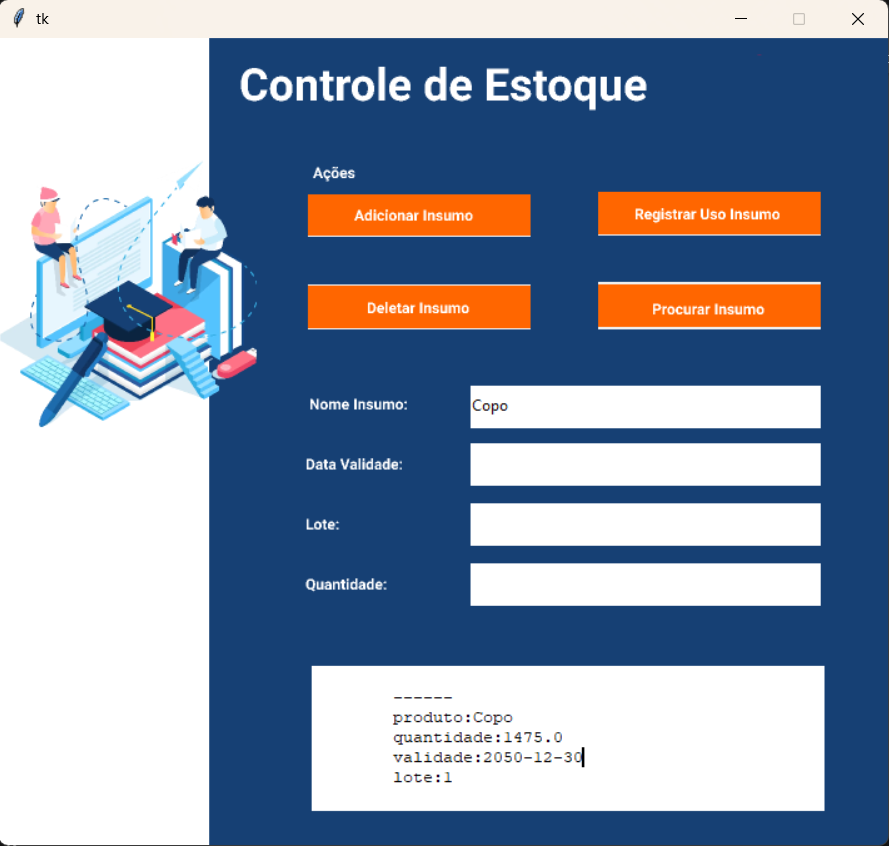

# 🗄️ Controle de Estoque com Python

Sistema desktop de Controle de Estoque desenvolvido com 
Python, Tkinter e SQLite, aplicando as 4 operações do CRUD 
em uma interface gráfica funcional e intuitiva.

## 💻 Interface


## ⚙️ Funcionalidades
- **Adicionar Insumo** — Cadastra novo produto no estoque
- **Procurar Insumo** — Busca e exibe insumos cadastrados
- **Registrar Uso** — Atualiza quantidade ao consumir insumo
- **Deletar Insumo** — Remove produto por nome e lote

## 🛠️ Tecnologias Utilizadas
- Python 3
- Tkinter (interface gráfica)
- SQLite (banco de dados local)
- Pyodbc (conexão com banco de dados)

## ▶️ Como Executar
1. Clone o repositório
```bash
   git clone https://github.com/ViniciusCavalcanti-03/controle-estoque-python.git
```
2. Instale as dependências
```bash
   pip install pyodbc
```
3. Execute o arquivo principal
```bash
   python main.py
```

## 👤 Autor
**Vinicius Cavalcanti Vilela Lins**  
[LinkedIn](https://linkedin.com/in/vinicius-cavalcanti-si) | 
[GitHub](https://github.com/ViniciusCavalcanti-03)
